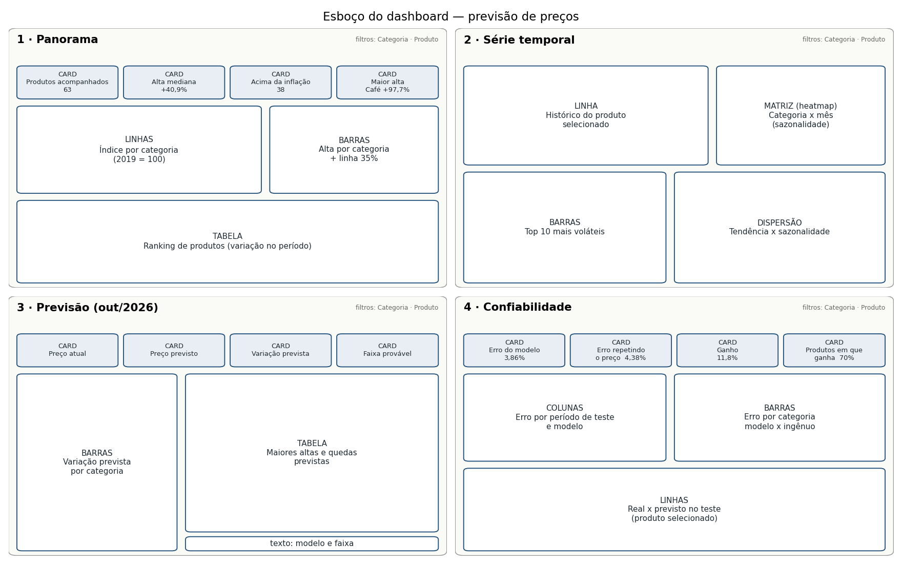

# Roteiro do dashboard

O que vai em cada página, card por card, e de onde vem cada número.
Os valores entre parênteses são os que devem aparecer com a base atual (dados até jul/2026),
para conferir se a medida está certa.

Todos os arquivos estão em `data/processed/powerbi/`. Importação, tipos e relacionamentos:
[`README.md`](README.md). Medidas prontas: [`medidas.dax`](medidas.dax).

**Nome dos produtos:** usar sempre `item_pt` (português). A coluna `item` é o nome original em inglês.
**Categoria:** usar sempre `dim_item[categoria]` (já corrigida).

Filtros que ficam no topo de todas as páginas: **Categoria** e **Produto** (`item_pt`).

---

## Página 1 — Panorama: quanto os preços subiram de 2015 a 2026

Pergunta que a página responde: *o que ficou mais caro e o que ficou mais barato em termos reais?*

**Linha de cards (4)**

| Card | Campo / medida | Valor esperado |
|---|---|---|
| Produtos acompanhados | `[Itens Ativos]` | 63 |
| Alta mediana no período | `[Variacao Mediana Periodo %]` | +40,9% |
| Produtos que subiram acima da inflação (35%) | `[Itens Acima da Inflacao]` | 38 |
| Maior alta | Top 1 de `dim_item` por `variacao_12m_pct` (card de texto: `item_pt`) | Café moído, +97,7% |

**Gráfico 1 — Linhas: índice de preço por categoria**
- Eixo X: `dCalendario[data]`
- Valor: `[Indice 2019 Mediana Categoria]`
- Legenda: `dim_item[categoria]`
- Título: "Preço por categoria (média de 2019 = 100)"
- Dica: deixar só 4-5 categorias ligadas por padrão (Carne bovina, Energia, Ovos, Padaria e grãos, Laticínios), senão vira espaguete.

**Gráfico 2 — Barras horizontais: alta por categoria**
- Eixo: `dim_item[categoria]`
- Valor: mediana de `dim_item[variacao_12m_pct]`
- Linha constante em 35 (inflação do período). No Power BI: painel Analytics > Linha constante.
- Ordenar do maior para o menor. Esperado: Carne bovina, Mercearia e Energia no topo; Ovos embaixo.

**Tabela — Ranking de produtos**
- Colunas: `item_pt`, `categoria`, `media_12_inicio`, `media_12_fim`, `variacao_12m_pct`
- Filtro da tabela: `ativa = Verdadeiro`
- Ordenar por `variacao_12m_pct` decrescente.
- Formatação condicional (barra de dados) em `variacao_12m_pct`.

---

## Página 2 — Série temporal: como cada preço se comporta

Pergunta: *quais produtos oscilam mais e quais têm época do ano para ficar caros?*

**Gráfico 1 — Linha: histórico de preço do produto selecionado**
- Eixo X: `fato_precos[data]`; Valor: `[Preco Medio]`
- Usar com o filtro de Produto (ex.: Ovos mostra os picos de gripe aviária de 2015, 2023 e 2025).
- Se der: marcadores diferentes quando `imputado = Verdadeiro` (out/2025, meses sem coleta por causa do shutdown).

**Gráfico 2 — Matriz (heatmap): sazonalidade por categoria e mês**
- Linhas: `dim_item[categoria]`; Colunas: `sazonalidade[mes]`
- Valor: média de `sazonalidade[desvio_sazonal_pct]`
- Formatação condicional > cor de fundo, escala divergente (azul negativo, vermelho positivo, branco no zero).
- Leitura: morango fica ~20% mais barato em junho/julho e ~28% mais caro em dezembro.

**Gráfico 3 — Barras: produtos mais voláteis (Top 10)**
- Eixo: `item_pt`; Valor: `dim_item[vol_mensal_pct]`
- Filtro Top N = 10 por `vol_mensal_pct`.
- Esperado no topo: Morango (11,6%), Uva, Ovos (9,4%).

**Gráfico 4 — Dispersão: tendência x sazonalidade**
- Eixo X: `dim_item[forca_tendencia]`; Eixo Y: `dim_item[forca_sazonalidade]`
- Legenda: `categoria`; Detalhes: `item_pt`
- Filtro: `forca_tendencia` não está em branco (só as 60 séries modeladas).
- Leitura: quase todo mundo à direita (tendência forte); só laranja, morango, presunto e energia elétrica sobem no eixo Y.

---

## Página 3 — Previsão: o que esperar para os próximos 3 meses

Pergunta: *quanto cada produto deve custar em out/2026?*

**Linha de cards (4)** — reagem ao filtro de Produto

| Card | Campo / medida | Exemplo com Ovos |
|---|---|---|
| Preço atual (jul/2026) | média de `previsao_futura[preco_base]` | US$ 2,19 |
| Preço previsto (out/2026) | `[Preco Previsto]` | US$ 2,27 |
| Variação prevista | `[Variacao Prevista %]` | +3,5% |
| Faixa provável | `[Faixa Inferior]` e `[Faixa Superior]` (dois cards pequenos ou um card de texto) | US$ 1,70 a 2,39 |

Sem produto selecionado, os cards mostram a média geral; vale colocar o título "Selecione um produto".

**Gráfico 1 — Barras: variação prevista por categoria**
- Eixo: `previsao_futura[categoria]`; Valor: mediana de `variacao_prevista_pct`
- Cores: negativo em azul, positivo em laranja (formatação condicional por regra).
- Esperado: Energia em queda (-4%), Ovos (+3,5%) e Frutas em alta.

**Tabela — Maiores altas e quedas previstas**
- Colunas: `item_pt`, `categoria`, `preco_base`, `preco_previsto`, `faixa_inferior`, `faixa_superior`, `variacao_prevista_pct`
- Ordenar por `variacao_prevista_pct`.
- Esperado nos extremos: Diesel (-8,7%), Gasolina comum (-5,8%) ... Laranja (+9,5%), Morango (+20,2%).
- Obs.: morango e laranja sobem por sazonalidade (out é época de preço alto), não por "crise".

**Texto de rodapé (caixa de texto)**
"Previsão do modelo combinado (gradient boosting + SARIMA). A faixa cobre 80% dos erros observados no teste. 59 produtos; a alface romana fica de fora por falta de dados recentes."

---

## Página 4 — Confiabilidade: dá para confiar na previsão?

Pergunta: *o modelo é melhor do que simplesmente repetir o preço de hoje?*

**Linha de cards (4)** — filtro da página: `previsoes_teste[modelo] = "combinado"`

| Card | Campo / medida | Valor esperado |
|---|---|---|
| Erro médio do modelo (WAPE) | `[WAPE Teste]` | 3,86% |
| Erro de repetir o preço de hoje | `[WAPE Ingenuo]` | 4,38% |
| Ganho do modelo | `[Ganho sobre Ingenuo]` | 11,8% |
| Produtos em que o modelo ganha | `metricas_modelos[series_melhor_que_ingenuo_pct]` (corte 2024-12-01) | 70% |

Esses quatro são do teste principal (previsões de mar/2025 a jul/2026).

**Gráfico 1 — Colunas agrupadas: erro por período de teste e modelo**
- Eixo: `metricas_modelos[corte]`; Valor: `wape`; Legenda: `modelo`
- Mostrar só: `ingenuo`, `sarima`, `gradient_boosting`, `combinado` (4 cores dão conta; mais que isso polui).
- Título: "Erro (%) em 4 períodos de teste — menor é melhor"
- Leitura: combinado é o menor nos quatro.

**Gráfico 2 — Barras: erro por categoria, modelo x ingênuo**
- Eixo: `metricas_por_categoria[categoria]`; Valor: `wape`; Legenda: `modelo`
- Filtro: `modelo` em (`combinado`, `ingenuo`)
- Leitura: modelo ganha muito em Frutas, Ovos e carnes; perde um pouco em Aves e Bebidas (preço que quase não mexe).

**Gráfico 3 — Linhas: real x previsto no período de teste**
- Eixo X: `previsoes_teste[data_alvo]`
- Valores: `[Preco Real Teste]` e `[Preco Previsto Teste]`
- Filtro do visual: `modelo = "combinado"`; usar com o filtro de Produto.
- Bons exemplos para a apresentação: Morango (acerta a curva sazonal) e Ovos (queda depois do pico).

---

## Se faltar tempo

Prioridade: Página 3 (previsão) > Página 4 (confiabilidade) > Página 1 > Página 2.
As páginas 3 e 4 são as que mostram o modelo; a 1 e a 2 são análise descritiva.
